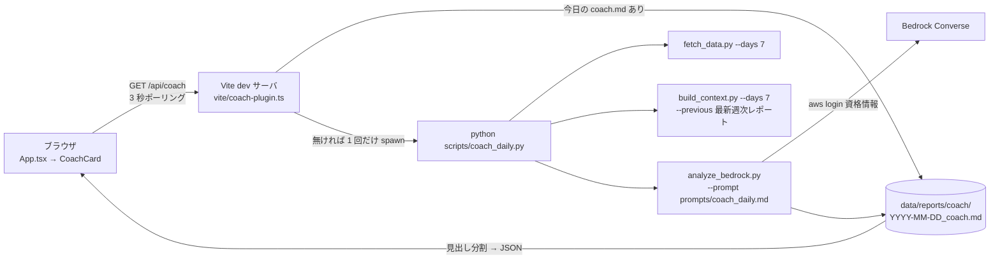

# spec.md — コーチカード（サイクル 1）

起案: 2026-08-24。設計判断の経緯は knowledge.md の ADR-001 を参照。

## 1. 目的

ダッシュボード（`npm run dev`）を開いたとき、その日のコーチング（今日の一手・昨日の答え合わせ・根拠）が画面最上部にカードで出る。解析は 1 日 1 回だけ走り、同じ日に何度開いても再解析しない。週次の深掘り（日曜朝・Opus 4.5・60 日文脈）は今の手動運用のまま継続し、日次カードは週次レポートの「今週の指示」を参照して答え合わせをする 2 段構成。

## 2. 全体構成（ADR-001 案 1: Vite ミドルウェア）

役割分担は「Node は起動判定・排他・整形だけ、解析ロジックは全部 Python」。Vite プラグインは 100 行以内を目安とし、超えそうになったら ADR-001 の覆る条件（FastAPI へ移行）を発動する。

## 3. API 契約（`GET /api/coach`）

| status | HTTP | 本文 | 発生条件 |
|---|---|---|---|
| `ready` | 200 | `{status, date, generatedAt, model, sections: [{title, body}], reportPath}` | 今日（JST）の `YYYY-MM-DD_coach.md` が存在 |
| `running` | 202 | `{status, startedAt}` | 実行中の Promise がある |
| `auth_required` | 200 | `{status, message}` | Python が exit 2（`aws login` 失効）。message は「`aws login` を実行してからリロード」 |
| `error` | 200 | `{status, message, logTail}` | exit 1 その他。logTail は stderr 末尾 20 行 |

- 排他: プラグインのモジュールスコープに `inflight: Promise<void> | null` を 1 つ持つ。実行中に来たリクエストは新規 spawn せず `running` を返す（リロード連打で Bedrock を 2 回呼ばない）。
- キャッシュ判定はファイルの存在のみ（`data/reports/coach/YYYY-MM-DD_coach.md`、日付は生成日 JST）。当日分を作り直したいときはファイルを消してリロードする（`?force=1` は Could）。
- `auth_required` と `error` は当日中に再試行できるよう、レポートを書かない（存在チェックが false のまま）。ただし同じ失敗を連打しないため、失敗から 60 秒は同じ結果を返す（メモリ上の `lastFailure`）。
- 解析中の進捗ストリームは作らない（要らなくなったら消す部品を最初から作らない）。

## 4. Python 側の変更

- `scripts/coach_daily.py`（新規・薄いオーケストレータ）: fetch → build_context → analyze を順に subprocess で呼び、いずれかの exit code をそのまま返す。引数 `--model-id`（必須）`--days`（既定 7）`--previous`（既定: `data/reports/` で最新の `*_analysis.md`）。
- `scripts/analyze_bedrock.py`: `--prompt`（既定 `prompts/health_analysis.md`）と `--output`（既定は現行の `data/reports/{end}_analysis.md`）を追加。既定値で呼べば週次の挙動は変わらない。
- `scripts/build_context.py`: 変更なし（`--days 7 --previous <週次レポート>` で流用）。
- `prompts/coach_daily.md`（新規）: 出力は固定 4 見出し `## 今日の一手` / `## 昨日の答え合わせ` / `## 根拠データ` / `## 注意`。各見出し 3〜5 行、全体 600 文字以内。週次と同じ禁止事項（データで分かることを聞かない・出典必須）を継承する。見出し文字列は Node 側では参照しない（`## ` で機械的に分割するだけ）ので、週次で起きた見出しリテラルの二重管理は発生しない。

## 5. フロント側の変更

- `src/components/CoachCard.tsx`（新規）: 4 状態を描画する。`loading`（「解析中… N 秒」を経過秒で更新）/ `ready`（セクションごとに見出し＋本文。`- ` 始まりの行だけ箇条書きに変換、それ以外は段落。Markdown ライブラリは追加しない）/ `auth_required`（手順 1 行＋リロードボタン）/ `error`（message ＋ logTail を折りたたみ）。
- `src/App.tsx`: `Dashboard` の上に `<CoachCard />` を 1 行差し込む。`Dashboard.tsx` 以下の既存コンポーネントは変更しない（plan.md §3 Won't「ダッシュボード画面の改修」と整合）。
- `vite.config.ts`: `coachApiPlugin()` を plugins に追加（実体は `vite/coach-plugin.ts`）。
- 見た目は既存のトークン（`bg1` / `text2` 等）と HeroScore と同じ角丸・余白を踏襲する。新規の美的方向性は起案しない（既存ダッシュボードの方向性を継承。カード 1 枚の追加で別方向を持ち込まない）。

## 6. モデルとコスト（設定値として扱う）

- モデル ID は `coach_daily.py --model-id` で渡し、`package.json` の `dev` スクリプトか `.env`（`COACH_MODEL_ID`）で固定する。コード内にリテラルで持たない。
- 既定は Sonnet 4.5（cross-region inference profile。ID は着手時に `aws bedrock list-inference-profiles` で確認）。前提は「Bedrock の Anthropic モデルは実課金」（knowledge.md ADR-001 のクレジット調査）。
- 概算（¥150/$、7 日文脈 ≈ 16k トークンは 60 日 109k からの按分推定）: Sonnet 4.5 で 1 回 ≈ $0.08、月 30 回 ≈ ¥360。週次 Opus 4.5 と合算 ≈ ¥750/月。
- 08-31 の `aws login` 時に Cost Explorer で 08-23 分の Opus 4.5 利用にクレジットが当たっているか確認し、当たっていれば日次も Opus 4.5 に切り替える（設定値の変更だけ）。

## 7. テストと受け入れ条件

- Vitest（`vite/coach-plugin.test.ts`）: spawn をモックする（理由: 実 Bedrock は課金と待ち時間が発生するため）。振る舞いで書く。
  - 今日のレポートがあるとき Python を起動せず `ready` を返す
  - 実行中に 2 回目のリクエストが来たとき spawn は 1 回のまま `running` を返す
  - Python が exit 2 のとき `auth_required` を返し、レポートを書かない
  - Python が exit 1 のとき `error` に stderr 末尾を含める
  - 失敗から 60 秒以内の再リクエストは再 spawn しない
- pytest: `analyze_bedrock.py --prompt/--output` の既定値で従来の出力パスが変わらないこと / `coach_daily.py` が子プロセスの exit code をそのまま返すこと（subprocess はモック）。
- 実物 1 件: 実際に `npm run dev` → ブラウザで `loading → ready` を目視し、生成された `coach.md` の数値主張を `data/context/*.md` と突き合わせる（週次で固めた検算手順）。
- 既存: pytest 53 件・ruff 0 件が維持されること。
- 完了の定義: 上記すべて＋ `docs/knowledge.md` に初回実行の入出力トークン数と実コストを記録。

## 8. 作らないもの（このサイクル）

進捗の SSE ストリーム / 手動再解析ボタン（`?force=1`）/ 静的ビルド（`npm run build`）対応 / カード内での対話 / 日次の自動実行（PC 起動時 cron）。いずれも ADR-001 の覆る条件が発動したときに再検討する。
