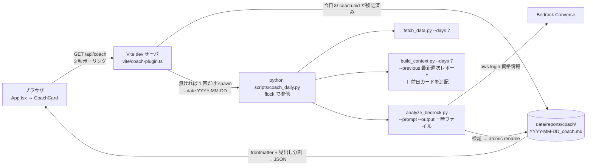

# spec.md — コーチカード（サイクル 1）

起案: 2026-08-24。設計判断の経緯は knowledge.md の ADR-001（実行経路の選定・捨てた案・覆る条件・クレジット調査）を参照。Codex（gpt-5.6-sol）の敵対的検証 18 件の採否は knowledge.md 同日の項に記録。

## 1. 目的

ダッシュボード（`npm run dev`）を開いたとき、その日のコーチング（今日の一手・昨日の答え合わせ・根拠）が画面最上部にカードで出る。解析は 1 日 1 回が原則で、同じ日に何度開いても再解析しない。週次の深掘り（日曜朝・Opus 4.5・60 日文脈）は今の手動運用のまま継続し、日次カードは週次レポートの「今週の指示」と前日のカードを参照して答え合わせをする 2 段構成。

「1 日 1 回」の保証範囲は**同時実行と当日の再実行を防ぐ**ことまで。Bedrock が課金した直後にプロセスが落ちた場合の逐次的な二重呼び出し（最悪 1 回 ≈ $0.08）は許容し、永続的な実行台帳は作らない（本人専用・実装コストが損失を上回る）。

## 2. 全体構成（ADR-001 案 1: Vite ミドルウェア）

役割分担は「Node は起動判定・排他・タイムアウト・整形だけ、解析ロジックと出力の検証は全部 Python」。Vite プラグインは 120 行以内を目安とし、次のいずれかが要件になったら ADR-001 の覆る条件（FastAPI へ移行）を発動する: 進捗のストリーム表示 / 静的ビルドでの利用 / 他人・スマホからの閲覧 / 手動再解析などエンドポイントが 3 本以上に増える。

plan.md §3 の Won't「ダッシュボード画面の改修」は「`Dashboard.tsx` 以下の既存コンポーネントを変更しない」と読み、`App.tsx` への 1 行差し込みと新規 `CoachCard.tsx` はその範囲外とする。

## 3. API 契約（`GET /api/coach`）

### 3.1 レスポンス

| status | HTTP | 本文 | 発生条件 |
|---|---|---|---|
| `ready` | 200 | `{status, date, generatedAt, modelId, days, sections: [{title, body}], reportPath}` | 対象日の `YYYY-MM-DD_coach.md` が存在し検証を通る |
| `running` | 202 | `{status, startedAt}` | 実行中の子プロセスがある |
| `auth_required` | 200 | `{status, message}` | Python が exit 3（`aws login` 失効）。message は「`aws login` を実行してからリロード」 |
| `error` | 200 | `{status, message, retryAfter, logTail}` | exit 3 以外の非 0 / signal 終了 / spawn 失敗 / タイムアウト / exit 0 だがレポート無しまたは検証不合格 |

型: `date` は `YYYY-MM-DD`（JST）、`generatedAt` と `startedAt` はタイムゾーン付き ISO 8601、`retryAfter` は秒（整数）、`logTail` は `string[]`（stderr 末尾 20 行、合計 2,048 バイトで打ち切り。本人専用なので機密除去はしない）。`modelId` と `generatedAt` と `days` はレポートの YAML frontmatter から読む（現在の設定値を返さない。設定変更後に古いカードのモデルを偽らないため）。

### 3.2 判定の優先順位（リクエストごと）

1. `targetDate` を JST の今日で計算する（Node 側が唯一の決定主体。Python にはこれを `--date` で渡す）。
2. `data/reports/coach/{targetDate}_coach.md` が存在し検証（§4.4）を通れば `ready`。
3. `inflight` があれば `running`（`inflight` は spawn の**同期的な直前**に設定し、await を挟まない。TOCTOU を作らない）。
4. `lastFailure` が `error` かつ 60 秒以内なら `error` に `retryAfter` を付けて返す。`auth_required` は 60 秒キャッシュの対象外（Bedrock を呼ばず安価に失敗するので、`aws login` 後のリロードで即再試行できる）。
5. それ以外は spawn して `running` を返す。

### 3.3 子プロセスの扱い

- Python 実行体は `.venv/bin/python` が存在すればそれ、無ければ `python3`（素の `python` はこの環境に無い。knowledge.md 既知事項）。`spawn(pythonBin, ["scripts/coach_daily.py", "--date", targetDate, "--model-id", modelId], {stdio: ["ignore", "pipe", "pipe"], detached: true})`。stdout/stderr は常に読み捨て（パイプ詰まりによる停止を防ぐ）、stderr は末尾 20 行だけ保持。
- 子が exit 4（別プロセスがロック保持中）を返したら、以後 10 秒間は再 spawn せず `running` を返す（3 秒ポーリングとの組で spawn 連打にしない）。`running` レスポンスの完成判定は spawn 時に固定した `targetDate` のファイルで行う。
- 全体タイムアウト 600 秒。超過したらプロセスグループごと SIGTERM → 5 秒後 SIGKILL し、`error`（message は `timed_out`）。タイムアウト後の自動再試行はしない（60 秒キャッシュに乗る）。
- `finally` で `inflight` を解放する。Vite 終了時（`server.httpServer.on("close")`）に子プロセスが残っていれば同じ手順で止める。
- `modelId` は環境変数 `COACH_MODEL_ID` のみから読む（`package.json` には書かない。二重定義を作らない）。未設定なら spawn せず `error`（message は「`COACH_MODEL_ID` が未設定」）。

## 4. Python 側の変更

### 4.1 `scripts/coach_daily.py`（新規・薄いオーケストレータ）

- 引数: `--date`（必須、JST の対象日＝生成日）`--model-id`（必須）`--days`（既定 7）。
- 排他: `data/reports/coach/.lock` を `fcntl.flock(LOCK_EX | LOCK_NB)` で取得。取れなければ exit 4（`already_running`。Node は `running` として扱う）。取得後に完成ファイルの存在を再確認し、あれば何もせず exit 0。
- 手順: (1) `fetch_data.py --days {days}`（`--end` は既定＝JST の昨日） (2) `build_context.py --days {days} --end {昨日} --previous {最新週次レポート} --output data/context/{date}_coach_context.md`（**週次の context と別名にする**。週次が日曜に作った `{end}_context.md` を月曜の日次が同名上書きし、週次の検算原本を壊す事故を防ぐ） (3) 前日の `{date-1}_coach.md` があれば **coach 用 context ファイル**の末尾に `## 前日のコーチカード` として全文を追記 (4) `analyze_bedrock.py --model-id … --context data/context/{date}_coach_context.md --prompt prompts/coach_daily.md --days {days} --output {tmp}`（context は明示指定。tmp はレポートと同一ディレクトリの `.{date}_coach.md.tmp`） (5) 出力を検証（§4.4）して `os.replace` で最終名へ atomic rename。
- 終了コード（Node との契約）: 0 = 成功 / 3 = 認証失効（`analyze_bedrock.py` の exit 2 を変換） / 4 = ロック取得不可 / 1 = それ以外（argparse の 2 を含む子の非 0 はすべて 1 に正規化し、どの工程で落ちたかを stderr に 1 行出す）。
- 最新週次レポートは `data/reports/*_analysis.md` のうちファイル名の日付が `--date` 以前で最大のもの。無ければ `--previous` を渡さず、prompt 側で「週次の指示なし」として扱う。

### 4.2 `scripts/analyze_bedrock.py`

- `--prompt`（既定 `prompts/health_analysis.md`）と `--output`（既定は現行の `data/reports/{end}_analysis.md`）を追加。既定値で呼べば週次の挙動（プロンプト・出力先・Bedrock リクエスト本文）は変わらない。
- YAML frontmatter に `model_id` / `generated_at`（タイムゾーン付き）/ `end` / `days` / `prompt` を書く（既存の frontmatter に不足分を追加）。
- `--max-tokens` を追加（既定は現行 4000。日次は 1500 を渡す。出力課金の上限）。
- `--days` を追加（frontmatter の `days` はこの引数を正とする。context 本文の散文からの正規表現抽出は引数省略時のフォールバックに格下げ。抽出失敗で `days: null` → 恒久 `report_invalid` になる経路を塞ぐ）。
- Converse レスポンスの `stopReason` を確認し、`max_tokens` なら出力切れとして exit 1（メッセージに「maxTokens 上限で切れた」を含める。切れた出力を §4.4 の検証に回して原因不明の `.rejected` にしない）。

### 4.3 `scripts/build_context.py`

`--output` を追加（既定は従来の `data/context/{end}_context.md` のままで週次挙動は不変）。他は変更なし。

### 4.4 出力の検証（`coach_daily.py` 内、`ready` の条件）

frontmatter が YAML として読める / 本文に `## 今日の一手` `## 昨日の答え合わせ` `## 根拠データ` `## 注意` の 4 見出しが**この順で各 1 回**ある / これ以外の `## ` 見出しが無い / 各セクション本文が非空 / 本文合計 1,200 文字以内。1 つでも落ちたら tmp を `.{date}_coach.md.rejected` に改名して exit 1（当日の再試行は可能。rejected は人が読んで捨てる）。Node 側も `ready` を返す前に同じ検証を行う（Python が書いた後に人が手で壊した場合の防御）。

二重実装の乖離を防ぐ共通規則: 行分割は LF（`\n`）のみ（Python も `splitlines()` ではなく `split("\n")` を使う。U+2028 等の Unicode 改行で片側だけ分割される乖離を防ぐ）/ frontmatter のキーと値は strip 後に比較 / この規則を両実装のコメントに明記し、同一入力 9 ケース（正常・U+2028 混入・先頭空白キー・コロン入り値・日本語値ほか）の往復パリティテストを Python・Node 双方に置く。

### 4.5 `prompts/coach_daily.md`（新規）

出力形式は §4.4 の 4 見出し固定・全体 1,000 文字目安（上限 1,200）。「昨日の答え合わせ」の対象は**前日のコーチカードの「今日の一手」**（無ければ週次レポートの「今週の指示」）で、評価は Fitbit / Tanita で観測できる指標だけで行い、観測できない項目は「データでは判定不能」と書く。週次と同じ禁止事項（データで分かることを本人に聞かない・数値主張には根拠の日付と値を添える）を継承する。見出しリテラルは Python の検証（§4.4）と二重管理になるため、変更時は両方を変える旨をプロンプト冒頭のコメントに書く。

## 5. フロント側の変更

- `src/components/CoachCard.tsx`（新規）: 5 状態を描画する。`loading`（初回取得中）/ `running`（「解析中… N 秒」を `startedAt` からの経過秒で更新）/ `ready`（セクションごとに見出し＋本文。`- ` 始まりの行だけ箇条書き、それ以外は段落。Markdown ライブラリは追加しない）/ `auth_required`（手順 1 行＋「再読み込み」ボタン。押すと即 fetch）/ `error`（message ＋ `retryAfter` 秒のカウントダウン ＋ logTail を折りたたみ）。fetch 例外・非 JSON・404 は `error`（message は「dev サーバに接続できません」）。
- ポーリング: `running` のときだけ 3 秒間隔。`ready` / `auth_required` / `error` に入ったら止める。アンマウント時にタイマーを解除する。
- `src/App.tsx`: `<CoachCard />` は health.json の読み込み状態（loading / error）に**関わらず常に表示**する（早期 return の外に置く。health.json が壊れていてもコーチカードは独立して動く）。`Dashboard.tsx` 以下は変更しない。
- `vite.config.ts`: `coachApiPlugin()` を plugins に追加（実体は `vite/coach-plugin.ts`）。
- 見た目は既存のトークン（`bg1` / `text2` 等）と HeroScore と同じ角丸・余白を踏襲する。新規の美的方向性は起案しない（既存ダッシュボードの方向性を継承）。

## 6. モデルとコスト（設定値として扱う）

- モデル ID は `COACH_MODEL_ID`（`.env`）のみで指定。既定候補は Sonnet 4.5 の cross-region inference profile（ID は着手時に `aws bedrock list-inference-profiles` で確認。呼び出し元リージョンは既存どおり us-east-1）。前提は「Bedrock の Anthropic モデルは実課金」（ADR-001 のクレジット調査）。
- 概算（¥150/$、Sonnet 4.5 入力 $3 / 出力 $15 per 1M トークン、リージョナル +10% は含まない）:

| 内訳 | トークン（推定） | 根拠 |
|---|---|---|
| 日次データ 7 日分 | ≈ 12,700 | 週次実績 108,904 × 7/60 |
| プロンプト＋本人プロフィール | ≈ 2,000 | 週次の固定部分（実測で補正） |
| 週次レポート抜粋＋前日カード | ≈ 1,500 | 週次 1,794 出力トークンの一部＋カード 1,200 文字 |
| 入力合計 | ≈ 16,000 | 1 回 ≈ $0.048 |
| 出力（上限 1,500） | ≈ 900 | 1 回 ≈ $0.014（上限でも $0.023） |
| 1 回 | — | ≈ $0.06（上限ケース $0.07） |
| 月 30 回 | — | ≈ $1.9（¥280）。再試行・二重呼び出しを含む最悪ケースは 2 倍で ¥560 |
| 週次 Opus 4.5 と合算 | — | ≈ ¥670/月（最悪 ¥950） |

- 初回実行後に frontmatter のトークン実測値で表を更新する。
- 08-31 の `aws login` 時に Cost Explorer で 08-23 分の Opus 4.5 利用にクレジットが当たっているか確認し、当たっていれば `COACH_MODEL_ID` を Opus 4.5 に切り替える（設定値の変更だけ）。

## 7. テストと受け入れ条件

### 7.1 Vitest（`vite/coach-plugin.test.ts`）

spawn・時計・ファイルシステムをモックする（理由: 実 Bedrock は課金と待ち時間が発生するため。時計は日付跨ぎと 60 秒境界を決定的にするため）。振る舞いで書く。

- 対象日のレポートが検証を通るとき Python を起動せず `ready` を返す
- レポートはあるが 4 見出しが欠けるとき `ready` にせず `error` を返す
- 同時に来た 2 つの冷起動リクエスト（`Promise.all`）で spawn は 1 回、片方は `running`
- 実行中の再リクエストは spawn を増やさず `running`
- 子が exit 3 のとき `auth_required` を返し、直後の再リクエストは 60 秒を待たず再 spawn する
- 子が exit 1 のとき `error` に stderr 末尾を含め、60 秒以内の再リクエストは再 spawn せず `retryAfter` を返す
- 子が exit 4（ロック取得不可）のとき `running` を返す
- 600 秒を超えたら子を止めて `error`（`timed_out`）を返し、`inflight` が解放される
- 子が exit 0 なのに対象日のファイルが無いとき `error` を返す
- 23:59 に spawn した処理は翌日になっても spawn 時の `targetDate` で完成判定する
- `COACH_MODEL_ID` 未設定のとき spawn せず `error`
- レスポンスの型（`date` 形式・ISO 8601・`logTail` が配列）をスキーマで検証する

### 7.2 pytest

- `analyze_bedrock.py`: `--prompt` / `--output` / `--max-tokens` を省略したとき、Bedrock に渡すモデル・プロンプト・`maxTokens` と出力パスが変更前と一致する（固定 fixture で組み立てた引数を比較。Bedrock クライアントはモック）
- `coach_daily.py`: 子の exit 2（analyze の認証失効）を 3 に、argparse の 2 を 1 に変換する / ロックが取れないとき 4 / 検証不合格の出力は `.rejected` に退避して最終名を作らない / 成功時に `data/reports/coach/` 以外へ書き込まない（週次の `*_analysis.md` が不変）/ 前日カードがあるとき context 末尾に追記される / 週次レポートが無いとき `--previous` を渡さない
- 出力検証（§4.4）: 見出し重複・順序違い・空セクション・1,200 文字超・余分な `## ` の各ケースで不合格

### 7.3 実物 1 件と完了の定義

- 実際に `npm run dev` → ブラウザで `running → ready` を目視し、生成された `coach.md` の数値主張を `data/context/*.md` と突き合わせる（週次で固めた検算手順）。
- 既存の pytest 53 件・ruff 0 件・`npm run lint`（ESLint）0 件・`npx tsc -b --noEmit` 0 件が維持されること。
- 完了の定義: 上記すべて＋ `docs/knowledge.md` に初回実行の入出力トークン数と実コストを記録し、§6 の表を実測で更新。

## 8. 作らないもの（このサイクル）

進捗の SSE ストリーム / 手動再解析ボタン（当日分を作り直すときはファイルを消してリロード）/ 静的ビルド（`npm run build`）対応 / カード内での対話 / 日次の自動実行（PC 起動時 cron）/ 永続的な実行台帳（§1）/ JSON 構造化出力への変更（Markdown はそのまま Vault に置けるため維持し、検証で代替）/ stderr の機密除去 / 当日データ未同期の `data_pending` 状態（Fitbit の日次サマリは前日分までで、欠測は既存の取り込みが欠測として扱う）。いずれも ADR-001 の覆る条件が発動したときに再検討する。
